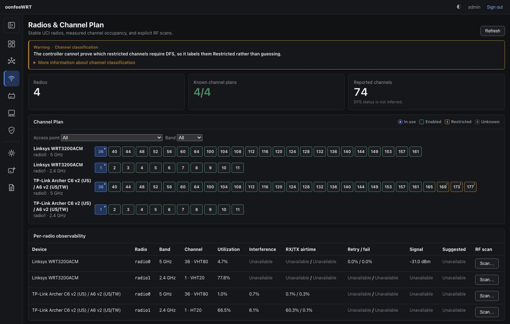

# oonfeeWRT

Self-hosted, UniFi-inspired management for stock OpenWrt.

[](https://github.com/aiden0rchad/oonfeeWRT/releases)
[](https://github.com/aiden0rchad/oonfeeWRT/actions/workflows/ci.yml)
[](LICENSE)
[](https://aiden0rchad.github.io/oonfeeWRT/)

**[Explore the complete documentation →](https://aiden0rchad.github.io/oonfeeWRT/)**
Capabilities, guided setup, safe configuration, operations, security,
troubleshooting, and engineering reference—with full-text search and light/dark
themes.

oonfeeWRT is a controller, not firmware. It runs on your server, NAS, mini-PC,
or Mac and manages OpenWrt devices through their existing interfaces. Your
routers stay on stock OpenWrt and continue to work with LuCI.

**Docker is optional.** Run the standalone binary directly on a supported
64-bit Linux or macOS host, or use the container/Compose setup. The controller
does not need a dedicated machine and is not installed on the managed routers.

## Preview

[](docs/images/dashboard-overview.jpg)

*Live Internet health, controller-host speed tests, and fleet status.*

[](docs/images/radios-channel-plan.jpg)

*Live radio inventory and evidence-aware channel planning.*

## What it provides

- A fleet dashboard with WAN reachability and throughput when the controller
  can prove one unique, usable lowest-metric main-table IPv4 default
  route—including PPPoE runtime devices—and the exact runtime device exists in
  RX/TX history, plus topology, clients, radios, events, and controller-host
  speed tests.
- Reviewed site configuration for networks, VLANs, DHCP, firewall zones, and
  WLANs, with OpenWrt's rollback timer protecting every Apply.
- Device adoption, health monitoring, telemetry, logs, RF tools, and explicit
  source-coverage gaps instead of guessed data.
- A sanitized, versioned compatibility-report download after read-only Inspect,
  with hardware/capability evidence but no address, MAC, credentials, network
  configuration, clients, timestamps, or free-text notes.
- Local owner, administrator, operator, and read-only accounts with session
  management and revocation.
- Downloadable, redacted diagnostics bundles containing controller evidence and
  stored router model, firmware, and capability data.
- Encrypted controller backup and staged restore with compatibility checks,
  controlled restart, and a persistent router-write gate.
- Optional LLDP using the official OpenWrt `lldpd` package, with an exact plan,
  separate consent, durable ownership records, and rollback.

## Project boundaries

oonfeeWRT does not build or replace OpenWrt, run controller-authored software on
routers, broker cloud access, or silently install packages.

Adoption can create only one scoped `oonfeewrt` login and one rpcd ACL JSON
file after you approve the displayed plan. The router administrator credential
used for that one-time action is not stored. Optional packages and
configuration changes have separate review and consent flows.

The controller changes only UCI sections it owns. Existing human-managed
sections remain visible but are not silently rewritten.

## Installation options and requirements

oonfeeWRT supports two equivalent ways to run the controller:

| Method | Supported controller hosts | Notes |
|---|---|---|
| Standalone binary | `linux/amd64`, `linux/arm64`, `darwin/amd64`, `darwin/arm64` | No Docker required; the UI is embedded in the binary |
| Container / Docker Compose | `linux/amd64`, `linux/arm64` images | Convenient for an existing NAS, mini-PC, SBC, or Docker Desktop host |

A controller host must be able to reach each router's management address.
Remote sites need an existing routed management network or VPN; oonfeeWRT does
not provide cloud brokering or automatic NAT traversal.

Managed routers require OpenWrt 21.02 or newer with SSH, `rpcd`, and the
`uhttpd` ubus handler. Hardware and driver capabilities still vary, so begin
with one non-critical device and review the detected capability gaps.

A 64-bit host with 1 GB of RAM and 2 GB of free storage is a practical starting
point. The controller's engineering envelope is at most 256 MB steady-state RSS
at 25 devices, 2% of one modern CPU core for an idle fleet, and 2 GB of disk at
the full 13-month retention depth.

oonfeeWRT is not memory-only. Raw telemetry is held in RAM temporarily;
completed rollups, configuration, accounts, events, and audit history are
stored in SQLite. Preserve the data directory and its matching `keyring.json`
and passphrase when running either installation method.

### Run the standalone binary

Download and checksum-verify the archive for your platform by following the
[binary installation guide](docs/INSTALL.md#install-the-binary), then run:

```sh
install -d -m 0700 "$PWD/data"
./oonfeewrtd -data-dir "$PWD/data" -listen 127.0.0.1:8080
```

The first interactive start asks you to create the controller passphrase. Open
[http://127.0.0.1:8080](http://127.0.0.1:8080) and create the first owner
account. For unattended startup, use `-passphrase-file` with a mode-`0600`
file as described in the installation guide.

### Run with Docker Compose

Requirements:

- Docker with Compose support.

Create a private working directory and download the release Compose file:

```sh
mkdir -p oonfeewrt
cd oonfeewrt

curl --fail --location \
  --output docker-compose.yml \
  https://raw.githubusercontent.com/aiden0rchad/oonfeeWRT/v0.1.3/deploy/docker-compose.yml

umask 077
head -c 32 /dev/urandom | base64 > passphrase
sudo chown 65532:65532 passphrase
sudo chmod 600 passphrase

OONFEE_VERSION=v0.1.3 docker compose up -d
```

Open [http://127.0.0.1:8080](http://127.0.0.1:8080) and create the first owner
account. The default Compose configuration publishes HTTP only on host
loopback, runs as UID 65532, drops all capabilities, uses a read-only root
filesystem, and stores controller state in a named volume. It pulls
`ghcr.io/aiden0rchad/oonfeewrt:v0.1.3` for `linux/amd64` or `linux/arm64`.

The `passphrase` file unlocks the controller keyring and is not your owner
account password. Back it up with the controller state and keep both private.
`docker compose down -v` deletes the named data volume.

Bridge networking works on Linux and Docker Desktop. The shipped discovery path
is a bounded TCP `/ubus` scan of eligible interface subnets; it does not use ARP
or mDNS. A container bridge usually does not expose the router's LAN subnet, so
add routers by address. Linux host networking can expose the host's LAN
interfaces and is an explicit opt-in described in the Compose file.

For checksummed binaries, signature verification, reverse-proxy TLS,
persistence, upgrades, and rollback, follow the
[installation guide](docs/INSTALL.md).

## Common questions

### Is Docker required?

No. Docker Compose is one quick-start option. The release also includes
standalone 64-bit Linux and macOS binaries with the web UI embedded.

### Does the controller run on an OpenWrt router?

No. It runs separately on a computer, NAS, SBC, or server and manages stock
OpenWrt devices. This keeps controller storage and upgrades away from the
routers' limited flash, RAM, and firmware lifecycle.

### Why does adoption ask for SSH access?

SSH is a bounded bootstrap, cleanup, and separately approved optional-package
path, not the steady-state management transport. Stock rpcd cannot create the
scoped login and ACL through ubus, even when logged in as root. The administrator
credential is used for the approved action and is not stored. Normal polling
and configuration use rpcd/ubus.

### What happens if a configuration change breaks connectivity?

Every Apply is previewed and uses OpenWrt's rollback window. The controller
confirms only after reconnecting and reading the expected state. If the router
becomes unreachable or the operation is interrupted, OpenWrt rolls the change
back. The controller also limits cleanup and writes to UCI sections it owns.

## First adoption

1. Set a router root password if it does not already have one:

   ```sh
   ROUTER_ADDRESS=192.0.2.1
   ssh -t root@"$ROUTER_ADDRESS" passwd
   ```

   The controller warns rather than blocking an explicitly trusted,
   passwordless lab router. Do not rely on that outside isolated testing.

2. In **Devices**, add the router by address or run the on-demand discovery
   scan.
3. Review the controller-access payload. Approving it creates the scoped login
   and ACL; cancelling changes nothing.
4. Inspect discovered capabilities and source gaps.
5. Preview configuration before Apply. Router changes never happen merely
   because a device was discovered or listed.

## Safety model

- Apply uses `uci.apply` with a rollback window, then confirms only after the
  controller can read the expected state. An interrupted or unhealthy Apply
  reverts on the router.
- Ownership tags restrict changes and cleanup to controller-created sections.
- RF scans, speed tests, capability installation, and other disruptive actions
  require explicit acknowledgement.
- Un-adoption restores or removes controller-owned configuration, then removes
  the scoped login and ACL. It is blocked while an optional LLDP installation
  still has a rollback record.
- Restoring a controller never automatically applies restored desired
  configuration. Router writes remain suppressed until an owner reviews and
  explicitly resumes them.
- The HTTP listener has no native TLS. Keep it on loopback or an isolated
  management network, and use a trusted reverse proxy for remote access.

## Backup and diagnostics

Owners can use **Settings → Backup & Restore** to export an encrypted
`.oowrtbak` file. Export requires recent account reauthentication and a
separate passphrase that the controller does not retain. Restore decrypts and
validates in disposable staging, shows a compatibility preview, creates a
safety backup, and completes through a controlled restart.

For filesystem-level recovery, `oonfeewrt.db` and `keyring.json` are one
unit. The runtime passphrase cannot recreate a lost keyring. See the
[installation guide](docs/INSTALL.md#back-up-and-upgrade) before copying live
state.

Diagnostics bundles are bounded, redacted ZIP files generated from stored
controller evidence. They make no router management call and exclude
credentials, WLAN keys, private keys, session material, and controller
passphrases.

## Current limitations

- End-to-end hardware validation covers a Linksys WRT3200ACM and TP-Link Archer
  C6 v2 on OpenWrt 25.12.5. Read-only inspection is additionally
  reporter-confirmed on one Cudy M3000 v2/MT7981 Filogic variant; adoption,
  Apply, VLANs, polling budgets, and other Filogic boards remain unverified.
  Three-or-more-AP fan-out, real mesh backhaul, wireless uplink, and MT7621
  also remain unverified.
- The speed test runs from the controller host or container through Cloudflare,
  not from a router. It uses approximately 15 MiB, is bounded to 30 seconds,
  and can temporarily saturate the WAN. Loaded latency and jitter are not
  measured.
- Native controller TLS, cloud remote access, and gateway-run speed tests are
  not included in v0.1.3.
- Optional LLDP may install official-feed packages. Adoption itself never
  installs a package, daemon, service, firmware, or executable.

Detailed hardware evidence and known gaps are in the
[fresh-start validation record](docs/FRESH-START-VALIDATION.md) and
[parity matrix](docs/PARITY-MATRIX.md).

## Build from source

Go 1.26.6 and Node.js 22 are the release toolchain.

```sh
make check
make build
./oonfeewrtd -data-dir "$PWD/.run" -listen 127.0.0.1:8080
```

For unattended startup, use `-passphrase-file` with a mode-`0600` file.
oonfeeWRT rejects passphrases supplied through environment variables.

## Documentation

- [Documentation site — capabilities, setup, guides, and troubleshooting](https://aiden0rchad.github.io/oonfeeWRT/)
- [Install, upgrade, TLS, and recovery](docs/INSTALL.md)
- [v0.1.3 release notes](RELEASE-NOTES-v0.1.3.md)
- [v0.1.2 release notes](RELEASE-NOTES-v0.1.2.md)
- [v0.1.1 release notes](RELEASE-NOTES-v0.1.1.md)
- [v0.1.0 release notes](RELEASE-NOTES-v0.1.0.md)
- [Architecture and security boundaries](docs/ARCHITECTURE.md)
- [Hardware validation](docs/FRESH-START-VALIDATION.md)
- [Feature parity and evidence](docs/PARITY-MATRIX.md)
- [Roadmap](docs/ROADMAP.md)
- [Risk register](docs/RISKS.md)

## License

Apache License 2.0. See [LICENSE](LICENSE), [NOTICE](NOTICE), and
[THIRD_PARTY_LICENSES](THIRD_PARTY_LICENSES). Every release archive and
container image includes the same notices.

## AI transparency

AI coding tools have been used substantially during development to help draft
and iterate on implementation code, tests, debugging, and documentation. The
maintainer supplies the product direction, networking architecture, security
boundaries, hardware knowledge, review, and final decisions, and remains
responsible for what the project ships.

AI output is not treated as evidence that the software is correct or secure.
CI runs Go tests, `go vet`, the race detector, `govulncheck`, UI unit and browser
tests, `npm audit`, release smoke tests, and repository/history secret scans.
Hardware behavior is checked separately against physical OpenWrt devices and
the known coverage gaps are published above.

oonfeeWRT has not received an independent security audit or third-party
penetration test. It is a new project: start with non-critical hardware, keep
backups, review every proposed router change, and report unexpected behavior.
